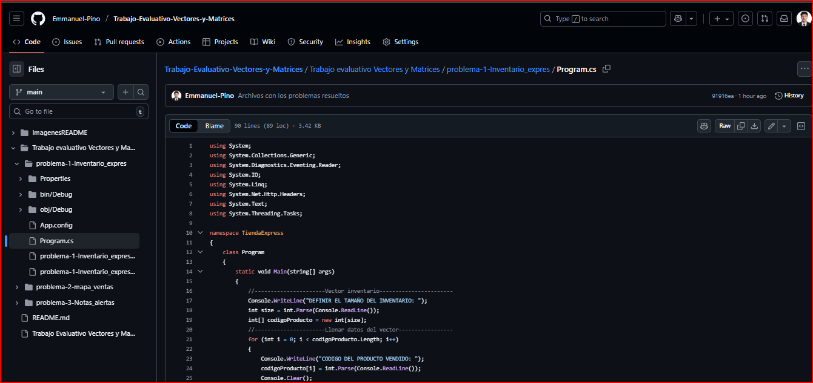

# Trabajo Evaluativo: Vectores y Matrices

## Requisitos
- Windows 10/11 con **Visual Studio 2019 o 2022** instalado.  
- **.NET Framework 4.7.2 o superior**

## Instrucciones de ejecución
### Opción 1:
1. Si solo necesita visualizar el codigo principal, abre la carpeta **Trabajo evaluativo Vectores y Matrices** allí encontrara las carpetas:
"problema-1-Inventario_expres
problema-2-mapa_ventas
problema-3-Notas_alertas"
2. Para visualizarlo solo debe hacer click en el Program.cs de cada una de estas carpetas

### Opción 2: Descargar ZIP
1. Ve a la página principal del repositorio en GitHub.  
2. Haz clic en el botón verde **Code**.  
3. Selecciona **Download ZIP**.  
4. Extrae el archivo ZIP en tu computador.  
5. Dentro de la carpeta extraída verás las subcarpetas:  
   - `problema-1-Inventario_expres`  
   - `problema-2-mapa_ventas`  
   - `problema-3-Notas_alertas`  
6. Ingresa a la carpeta del problema que quieras ejecutar.  
7. Abre el archivo `.csproj` con Visual Studio.
   

Integrantes
Emmanuel Pino Ramirez

Jelen Mildrei Alzate Rivera
